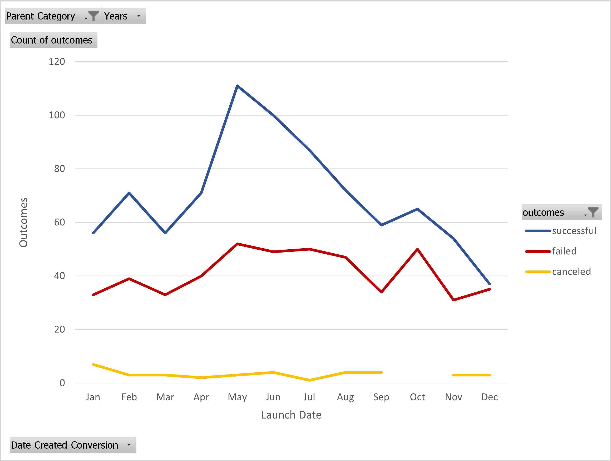
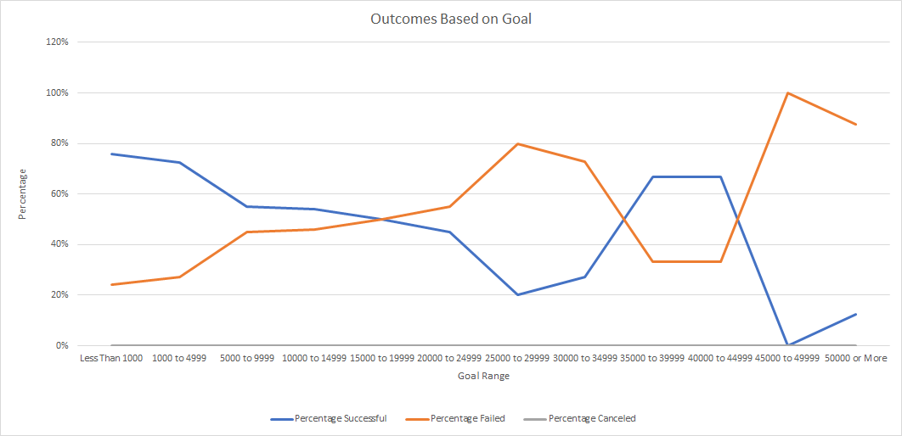

# Kickstarting with Excel

## Overview of Project

Project Name: "Crowfunding Campaign for "Fever""

Problem: Analyze a large set of data containing information related to fundraising campaings for different entertainment programs

Goal: Help Louise to determine if there is a relation between the rate of success and the fundraising goal, and if there is also a relation between the outcome and the launch date of the fundraising campaign

### Purpose
The purpose of this project is to put into practice different set of formulas used in Excel to extract only the data that will apply to the fundraising campaing. Once the data has been filtered and extracted, it will be possible to play with the data by creating pivot tables, and line charts, that will help Louise to gather the information required to start her fundraising campaign for "Fever".
	

## Analysis and Challenges
The project's goal is to analyze only the data that will apply to "theater" category, and more specifically to "plays" subcategory. However, the big challenge is that the data set is very large, and moreover, it contains different entertainment categories that do not apply to the one Louise needs. It also contains a different range of "goals" which makes the data set difficult to analyze at a first glance. Another challenge present is that both the dates for launch and deadline for the fundraising are in Unix Epoch format, which requires conversion to a more readable format.

### Analysis of Outcomes Based on Launch Date
In terms of outcomes based on launch date, the results show that for "successful" campaigns, the best time of the year to start a fundraising campaign is in the month of May with 111 successful events. The months of June and July complete the podium with 100 and 87 events respectivelly. The chart shows that February, April, and August are also good options to start a campaign but definitevely not the best compared to the first three. The chart also shows that to start a fundraising campaign, Louise should avoid to launch it in December.
Regarding "failed" events, the chart shows an interesting pattern, this is that the highest amount of failed events in the data set happened for those campaigns launched in May. This leads to investigate and analyze the data set even more to find if there is another factor that impacts the rate of success for a given event. 
In terms of canceled events, the chart shows that there is a constant number of events that were canceled with peaks in January and the lowest point in July.

### Analysis of Outcomes Based on Goals
Considering that there is more to analyze than rate of success based on launch date, the analysis on outcomes based on goals shows that setting a goal too high ($45,000 to $49,999 or more) has a negative impact in the outcome of the event. On the other hand, if the fundraising campaign has a goal of less than $1000 the rate of success if higher and the rate of failure is lower. For the range of $1,000 to 29,999, the chart shows that the higher the goal, the rate of success decreases while the rate of failure increases almost proportionally. However, for the range of $25,000 to $34,000, the lines shift and the percentage of successful events start to increase, whereas the percentage of failed events start to decrease, and both present no change for the range from $35,000 to $44,999.

### Challenges and Difficulties Encountered
During the analysis, the data set presented various challenges and difficulties that required to perform corrective actions in order to filter and extract the right data. One example of a challenging situation was with the date format. It required further reading to better understand the concept of the Unix Epoch format. Although it was not very challenging, at the beginnin, it was a not very clear format to understand or read. Another challenge was that, the data set by itself was very large, and it required the application of many formulas, filters, and pivot tables to get the right data for Louise so she can make the better choice for her fundraising campaign.

## Results
According to the analysis, there are two aspects to consider before starting a fundraising campaign:
1-Launch date:
The best month to launch a fundraising campaign is May, following by June and July.
2-Goal range:
The lower the goal, the more chances for the campaign to be successful, however, the chart also shows that a campaign with a goal range between $35,000 to $44,999 have a rate of success as good as the ones in the range of $1,000 to $4,999.
	
- What are two conclusions you can draw about the Outcomes based on Launch Date?

1- The best month to launch a fundraising campaign is May, whereas December has the lowest rate of success.
2- May is also the month with more failed campaigns, which indicates that there is more aspects to analyze in order to obtain a better understanding of the variables affecting the fundraising campaigns.

- What can you conclude about the Outcomes based on Goals?

1- In simple words, the lower the goal, the higher rate of success, However, the chart shows that for events with a goal between $35,000 to $44,999, the rate of success increases while the rate of failure decreases. It indicates that there is sill data to analyze to determine the reason of that shift in the lines.

- What are some limitations of this dataset?

There was way more information that the one the project really needed to analyze. As discussed in the introductory module, having more data, does not neccessarily means it will ease things.
Another aspect is the cell format for the information presented. Although it is raw data, it is always helpful to indicate the type of data we are working with.
	

- What are some other possible tables and/or graphs that we could create?
	
Louise might also need a table that indicates if plays from certain authors have more rate of success than plays from other authors (Shakespear, Homer, Wilde, etc). Another chart that Louise could use is one that reflects the reason why the fundarings campaigns with goals between $35,000 and $44999 have a rate of success similar to those in the range of less than $4,999. Perhaps it will be useful to work with information that reflects how the campaign was promoted and see if that impacts the outcome at the end.
